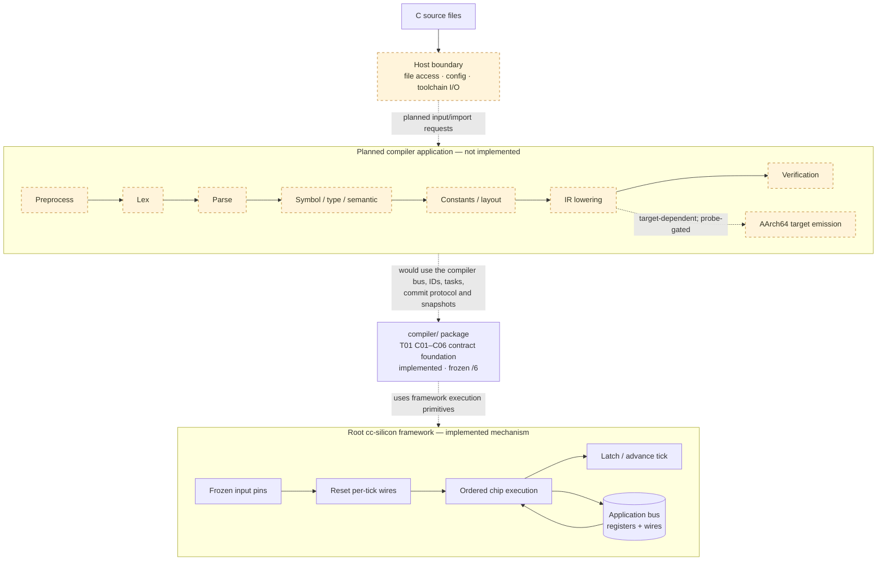
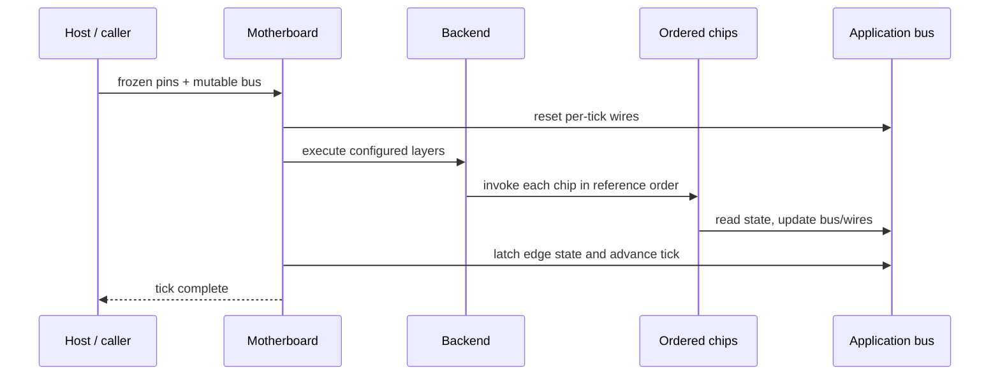

# cc-silicon

**A C compiler project built around the Silicon-Based Software Architecture.**

The intended product is a deterministic, chip-oriented C compiler. The
compiler's language pipeline is **not implemented yet**: this repository
currently contains the generic execution framework and a frozen compiler
contract foundation, but no C language chips or end-to-end compiler. The task
catalog and acceptance plans describe proposed work, not existing capability.
See [Project status](#project-status).

**New to this repository?** For a plain-language introduction, start
with [docs/guide/](docs/guide/README.md) (what it is, how it works,
what works today, what comes next). To contribute or assign work to an
AI agent, start with [docs/tasks/](docs/tasks/README.md). The
[docs map](docs/README.md) lists both entrances.

The architecture models computation as synchronous stages over explicit state:
host input is frozen into pins, stateless chips perform isolated work, and
committed state advances on ticks. The generic framework is an implementation
component of this compiler project, not the project's end goal.

---

## Project architecture

The repository has three layers. The compiler application contract and storage
foundation live in the nested `compiler/` package; the C language pipeline is a
planned application layer; the root crate supplies its generic tick/chip
execution mechanism. The planned language stages below are **not implemented**;
the staged-scheduler mechanisms (quota-bound dispatcher, bounded recovery,
canonical report) are frozen in the `/6` contract on a quota-1 baseline —
quota>1 stays measured post-freeze work.



The diagram separates the **compiler target** (the machine code generated for
the compiled program) from `cc-silicon::Backend` (the mechanism that executes
chips). AArch64 is the selected target identity, but its concrete ABI values
remain unverified; target code generation is fail-closed until probe evidence
is attested.

---

## Terminology

This project uses the following terms consistently:

| Term | Meaning |
|---|---|
| **Input Pins** | External inputs sampled and frozen for the current tick only |
| **System Bus** | The single flat state carrier: registers plus wires |
| **Registers** | State that persists across ticks |
| **Wires** | Per-tick ephemeral signals, reset at tick start |
| **Logic Chips** | Stateless transition units |
| **Motherboard** | Deterministic scheduler of chip layers |
| **Backend** | A realization of the semantic core on a substrate (CPU/GPU/HDL/…) |
| **Tick** | One full sample → propagate → latch cycle |

When discussing portability, **SFL (Silicon Formal Language)** is the semantic
source of truth, while Rust/C/CUDA/HDL implementations are backend realizations.
The formal multi-backend contract is documented in
[docs/architecture/SFL_CONTRACT.md](docs/architecture/SFL_CONTRACT.md).

---

### One framework tick



Clock lifecycle per tick: host sampling is outside the core; the motherboard
resets wires, delegates ordered propagation to its backend, then latches state
and advances the tick. The [`Bus`](src/bus.rs) exposes hooks for these phases.

---

## Execution framework component

The root Rust package implements the generic execution mechanism used by the
project. These APIs do not implement C parsing or compilation.

### `Bus` — the single source of truth

```rust
pub trait Bus: 'static {
    type Pins: Clone + 'static;
    type Wires: Default + Clone + 'static;

    fn wires(&self) -> &Self::Wires;
    fn wires_mut(&mut self) -> &mut Self::Wires;

    // hooks with sensible defaults
    fn reset_wires(&mut self) { *self.wires_mut() = Self::Wires::default(); }
    fn latch(&mut self, _pins: &Self::Pins) {}
    fn tick_count(&self) -> u64 { 0 }
    fn advance_tick(&mut self) {}
}
```

An application implements `Bus` on one flat struct holding all registers plus an
embedded wire bundle.

### `LogicChip` — a stateless transition unit

```rust
pub trait LogicChip<B: Bus> {
    fn tick(&self, pins: &B::Pins, bus: &mut B);
}
```

Chips are zero-field unit structs. They never call each other; data flows only
through the bus. `tick` returns `()` — errors are modelled as "blown fuse"
signals on the bus, never as panics.

For applications that want stronger enforcement, prefer `RestrictedChip` with
`silicon_chip!` and `Motherboard::install_projected`. Its computation receives
only a read-only input projection and returns a typed proposal; a separate
`ChipAdapter` projects bus fields and commits the proposal. The macro only
declares unit structs and compile-fail doctests verify that fields, bus access,
and input mutation are rejected. Adapters remain trusted application code, and
Rust cannot prove absence of global I/O or nondeterminism; enforce those with
crate boundaries, static linting, and deterministic replay tests.

### `Motherboard` — the clock driver

```rust
let mut mb = Motherboard::<MyBus>::new(2);
mb.install(0, DecodeChip);
mb.install(1, MutateChip);
mb.clock_tick(&pins, &mut bus);
```

`clock_tick` runs the three phases in order and is the only entity allowed to
invoke a chip or to reset/latch the bus.

### `Backend` — the realization layer

```rust
pub trait Backend<B: Bus> {
    fn name(&self) -> &str;
    fn execute_layers(
        &mut self,
        layers: &[Vec<Box<dyn LogicChip<B>>>],
        pins: &B::Pins,
        bus: &mut B,
    ) { /* reference: run every chip in order */ }
}
```

`CpuBackend` is the deterministic scalar reference. Replace it with
`Motherboard::with_backend(...)` to batch, fuse, offload, or emulate work while
preserving observable meaning.

### `Clock` — wall-clock sampling

Host-boundary helper that measures elapsed nanoseconds between ticks and clamps
surprises such as a suspended process.

### `Testbench` / `simulate` — headless verification

Run deterministic pin sequences and assert properties of the resulting bus.

### Restricted chips and static checks

For stronger separation between computation and bus mutation, implement
`RestrictedChip` and install it with `Motherboard::install_projected`. The chip
receives only an immutable input projection and returns a typed proposal; a
separate `ChipAdapter` builds that projection and commits the proposal. The
`silicon_chip!` macro declares a unit-struct chip, and compile-fail doctests
cover stateful declarations, direct bus access, and input mutation.

The optional AST-based chip linter in `tools/chip-lint` checks a source
directory for common violations, including legacy `LogicChip` implementations,
stateful chip structs, opaque macros, unsafe blocks, and common host or
nondeterministic APIs. Run it with:

```bash
cargo test --manifest-path tools/chip-lint/Cargo.toml
cargo run --manifest-path tools/chip-lint/Cargo.toml -- <chip-source-directory>
```

The linter is a conservative aid, not a proof of purity: Rust aliases, method
dispatch, and effects hidden in called helpers or dependencies may require
review. Keep adapters and helper functions auditable, isolate host I/O, and use
deterministic replay tests. The legacy `LogicChip` API remains available for
compatibility; use `RestrictedChip` for the stricter path.

---

## Project status

Each area below is either covered by tests in this repository or explicitly
marked as unimplemented. Documents under `docs/tasks/` are design and contract
proposals, not code.

| Area | State |
|---|---|
| Framework crate (`src/`) | **Implemented**: `Bus`, `LogicChip`, `RestrictedChip` + `silicon_chip!`, `Motherboard`, `Backend`/`CpuBackend`, `Clock`, `simulate`/`Testbench`. 15 integration tests + 6 compile-fail doctests; worked circuit in `examples/counter.rs` |
| Compiler contract foundation (`compiler/`) | **Implemented and frozen** as `t01-c01-c06/6`: storage profile, stable IDs, task/result/proposal protocol (five-outcome set), target model, SFL manifest extension with owner-allowlist skeleton, canonical snapshot/trace with `encode_*` round-trip, quota-bound dispatcher with bounded recovery, `m1-append/1` seed. 140 integration tests + 2 doctests; identity in [`compiler/contracts/CONTRACT_VERSION`](compiler/contracts/CONTRACT_VERSION) |
| C language chips (T02–T13) | **Not implemented.** Task packages, acceptance plans, and contract proposals only — see [`docs/tasks/README.md`](docs/tasks/README.md) |
| AArch64 target values | **UNVERIFIED.** The identity is frozen (`aarch64-unknown-linux-gnu`, ELF, LP64, little-endian, AAPCS64); codegen readiness fails closed until a probe attests concrete values |
| ABI probe harness (`tools/torture/probe/`) | Harness and normalizer self-tests pass, but the probe has **never run**: no report, no attestation, no verified ABI facts |
| GCC torture corpus lock (`tools/torture/`) | **Scaffold**: lock schema and verifier implemented and tested; no corpus fetched, no frozen lock, no pass rate |

Compiler capability, target verification results, and GCC pass rates are not
claimed anywhere in this repository.

---

## Quick start

The current executable example exercises the framework component; it is not a
C compiler. Run it with:

```bash
cargo run --example counter
```

The essential shape is: define `Pins`, `Wires`, and a `Bus`; implement
`LogicChip` for each unit struct; assemble layers; tick.

```rust
use cc_silicon::prelude::*;

#[derive(Clone, Copy, Debug, Default)]
struct Pins { pulse: bool }

#[derive(Clone, Debug, Default)]
struct Wires { edge: bool }

#[derive(Clone, Debug)]
struct MyBus { value: u32, wires: Wires, prev_pulse: bool, tick_count: u64 }

impl Bus for MyBus {
    type Pins = Pins;
    type Wires = Wires;

    fn wires(&self) -> &Wires { &self.wires }
    fn wires_mut(&mut self) -> &mut Wires { &mut self.wires }

    fn latch(&mut self, pins: &Pins) { self.prev_pulse = pins.pulse; }
    fn tick_count(&self) -> u64 { self.tick_count }
    fn advance_tick(&mut self) { self.tick_count = self.tick_count.wrapping_add(1); }
}

struct EdgeChip;
impl LogicChip<MyBus> for EdgeChip {
    fn tick(&self, pins: &Pins, bus: &mut MyBus) {
        bus.wires.edge = pins.pulse && !bus.prev_pulse;
    }
}

struct CountChip;
impl LogicChip<MyBus> for CountChip {
    fn tick(&self, _pins: &Pins, bus: &mut MyBus) {
        // Overflow is part of the chip's contract: wrap explicitly.
        if bus.wires.edge { bus.value = bus.value.wrapping_add(1); }
    }
}

fn main() {
    let mut mb = Motherboard::<MyBus>::new(2);
    mb.install(0, EdgeChip);
    mb.install(1, CountChip);

    let mut bus = MyBus { value: 0, wires: Wires::default(), prev_pulse: false, tick_count: 0 };
    for tick in 0..10u64 {
        let pins = Pins { pulse: tick % 2 == 0 };
        mb.clock_tick(&pins, &mut bus);
    }
    assert_eq!(bus.value, 5);
}
```

---

## Repository layout

```text
src/
  lib.rs            crate root and public re-exports
  bus.rs            Bus trait (System Bus: registers + wires)
  chip.rs           LogicChip trait
  motherboard.rs    Motherboard pipeline + clock_tick driver
  backend.rs        Backend trait + CpuBackend reference
  clock.rs          wall-clock sampling helper (host boundary)
  sim.rs            simulate() + Testbench for headless verification
  prelude.rs        convenient re-exports
examples/
  counter.rs        a complete minimal circuit
tests/
  paradigm.rs       framework-level tests on a neutral domain
compiler/                nested Cargo package: frozen T01 contract foundation
  src/                   arenas, ids, limits, target, task, bus, commit,
                         manifest, codec, snapshot, routing, contract, records
  contracts/             CONTRACT_VERSION (frozen identity) + SFL manifest doc
  examples/freeze_hash   recompute/publish the frozen contract hash
  tests/                 c01..c07 + freeze
docs/
  architecture/     paradigm spec, SFL contract + schema draft, ADR-0001, ADR-0002
  design/           blueprint + getting-started guide
  tasks/            compiler master plan, task packages T00–T13, acceptance plans
  reviews/          dated documentation/source audits (read-only records)
tools/
  chip-lint/        AST-based checks for chip source
  torture/          offline corpus-lock integrity and provenance verifier
  torture/probe/    AArch64 ABI probe harness + normalizer (never run)
.github/workflows/ CI for root/chip-lint/compiler; probe self-tests + manual probe
```

---

## Design rules

To preserve silicon semantics, compiler chips and other applications built on
the framework should obey these design rules:

- **No global mutable state** outside the bus passed during a tick.
- **No chip-to-chip calls** — communicate only through bus fields.
- **No implicit control flow** — model errors as blown-fuse wires, not panics.
- **No privilege escalation** — a chip touches only fields relevant to its duty.
- **Wires are per-tick** — never assume a wire survives a tick boundary.
- **The bus stays fixed-layout** — bus data has no heap; framework topology
  construction (motherboard layers, backends) allocates, while the default tick
  path does not ([ADR-0001](docs/architecture/ADR-0001-COMPILER-DYNAMIC-ARENA.md) §2).
- **Prefer testbenches and property tests** over anecdotal unit tests.

Many of these are enforced structurally by Rust: `&mut Bus` gives one exclusive
writer, `&Pins` is read-only, and zero-field unit structs cannot hide state.
`rustc` is therefore a *partial design-rule checker* — it cannot verify business
logic, which still requires tests and, where it matters, formal methods.

---

## Testing and verification

The root package is not a Cargo workspace, so every nested package needs its own
`--manifest-path`. These are the commands CI runs
([`.github/workflows/ci.yml`](.github/workflows/ci.yml)):

```bash
# framework (root package)
cargo fmt --all -- --check
cargo clippy --all-targets -- -D warnings
cargo test
cargo run --example counter

# chip linter
cargo fmt    --manifest-path tools/chip-lint/Cargo.toml -- --check
cargo clippy --locked --manifest-path tools/chip-lint/Cargo.toml --all-targets -- -D warnings
cargo test   --locked --manifest-path tools/chip-lint/Cargo.toml

# compiler contract foundation
cargo fmt    --manifest-path compiler/Cargo.toml -- --check
cargo clippy --locked --manifest-path compiler/Cargo.toml --all-targets -- -D warnings
cargo test   --locked --manifest-path compiler/Cargo.toml
```

Two coverage gaps are deliberate and recorded in
[`docs/reviews/2026-10-05_CI_GATING_AUDIT.md`](docs/reviews/2026-10-05_CI_GATING_AUDIT.md):
the `tools/torture` crate is not wired into CI, and the AArch64 probe job in
[`.github/workflows/t00-target-probes.yml`](.github/workflows/t00-target-probes.yml)
is `workflow_dispatch`-only. Its path-filtered self-test job
(`bash tools/torture/probe/tests/run-tests.sh`, no target compiler required) is
the only probe check that runs automatically; no merge depends on a real target
execution.

The paradigm maps cleanly onto a Mealy/Moore machine:

```text
S(t+1) = F(S(t), I(t))
```

where `S` is the full bus snapshot and `F` is the fixed layer-ordered chip
pipeline. The functional reading is a **conditional property**, not something
the public API guarantees: [`LogicChip`](src/chip.rs) accepts arbitrary `tick`
implementations, and the default [`Backend::execute_layers`](src/backend.rs)
just calls them, so neither trait can enforce purity, termination, or absence
of panics. The equation holds for chips, bus hooks, adapters, and backends that
satisfy four conditions: **purity** (no hidden state, I/O, or chip-to-chip
calls), **determinism** for fixed inputs, **termination**, and an **explicit
error/overflow contract** (every fault becomes a bus value, never a panic).
Under those conditions deterministic replay, fuzzing, and property-based
testing are natural fits; replay tests exercise the property on chosen traces
and are evidence for it, not a proof that it holds for every input.

---

## Framework backend outlook

The CPU backend is implemented as the reference realization of the generic
framework execution mechanism. This does not imply that the compiler pipeline
or compiler target backend exists. The SFL contract defines the boundary for
possible later framework realizations:

| Backend | Status | Notes |
|---|---|---|
| CPU scalar (reference) | Implemented | Root framework crate |
| SIMD / accelerated CPU | Future | Must remain semantically equivalent |
| GPU | Future | Batch/fuse chips; emulate or reject the rest |
| FPGA / ASIC (HLS) | Research | Fixed-width, synthesizable subsets only |
| Quantum-oriented | Speculative | Interface-level orchestration and reversible sub-circuits |

The rule is constant: backends realize meaning, they never redefine it. Any
behavior a backend cannot represent must be rejected or emulated explicitly —
silent semantic drift is forbidden.

---

## Documentation

| Document | Purpose |
|---|---|
| [docs/architecture/SILICON_PARADIGM_SPEC.md](docs/architecture/SILICON_PARADIGM_SPEC.md) | The paradigm, principles, and primitives |
| [docs/architecture/SFL_CONTRACT.md](docs/architecture/SFL_CONTRACT.md) | Multi-backend semantic contract |
| [docs/architecture/SFL_SCHEMA_DRAFT.md](docs/architecture/SFL_SCHEMA_DRAFT.md) | Structured document shape for tooling |
| [docs/architecture/ADR-0001-COMPILER-DYNAMIC-ARENA.md](docs/architecture/ADR-0001-COMPILER-DYNAMIC-ARENA.md) | **Accepted**: application-scoped CPU dynamic arena; the framework bus stays fixed-layout |
| [docs/architecture/ADR-0002-DETERMINISTIC-COMPILER-PIPELINES.md](docs/architecture/ADR-0002-DETERMINISTIC-COMPILER-PIPELINES.md) | **Proposed** as an ADR; its staged-scheduler mechanisms are frozen in the `/6` contract (quota-1 baseline) |
| [docs/design/ARCHITECTURAL_BLUEPRINT.md](docs/design/ARCHITECTURAL_BLUEPRINT.md) | How to build a system on cc-silicon |
| [docs/design/GETTING_STARTED.md](docs/design/GETTING_STARTED.md) | Step-by-step walkthrough |
| [compiler/README.md](compiler/README.md) | The frozen C01–C06 foundation: status, guarantees, hash scope, M0 gates |
| [compiler/contracts/COMPILER_SFL_MANIFEST.md](compiler/contracts/COMPILER_SFL_MANIFEST.md) | Manifest schema, read/write declarations, and commit-enforcement rules |
| [docs/tasks/README.md](docs/tasks/README.md) | Compiler master plan and task packages T00–T13 (design only) |
| [docs/reviews/](docs/reviews/) | Dated documentation and source audits (read-only records) |

---

## License

MIT — see [LICENSE](LICENSE).
