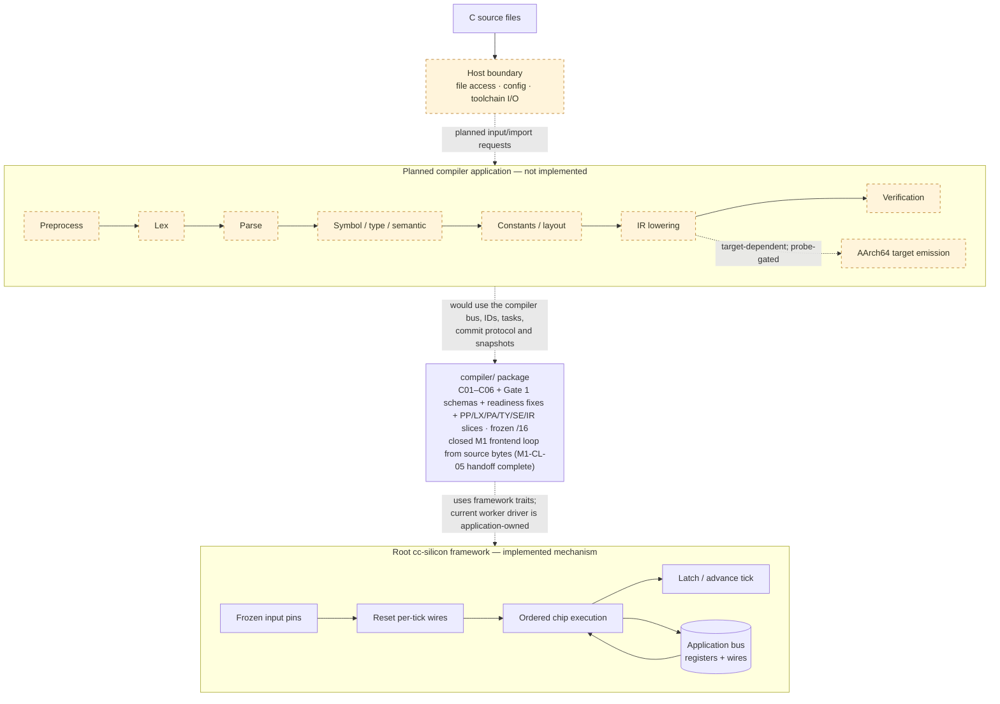
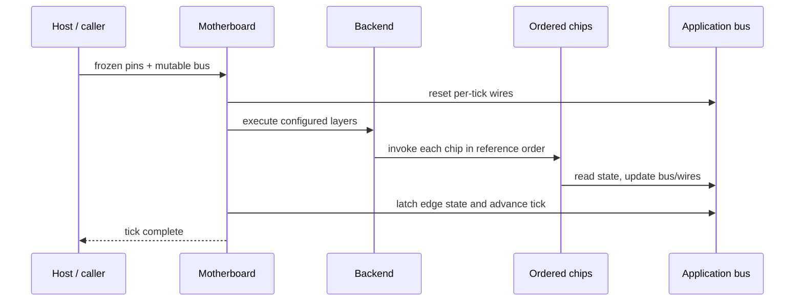

# cc-silicon

**A domain-free Rust execution framework for Silicon-Based Software Architecture,
with a chip-oriented C compiler application under development.**

Silicon models software as explicit state transformed by small, stateless chips
under declared access rules and a deterministic execution order. It is a general
software architecture, not a C-specific compilation technique. The root
`cc-silicon` crate supplies its execution primitives; `compiler/` is the complex
application being built on top of them.

Today the repository contains the generic framework, the frozen compiler
contract foundation (`t01-c01-c06/33`), with variadic + builtin macros working (PP01–04 + LX + PA + TY + SE + IR + verifiers, full PP scan, dispatch, conditionals, macros, expansion, include, variadic, builtins, line, pragma, expansion map, emit) plus float syntax/value checks (LX09 decimal/hex syntax, LX10 correctly-rounded binary32/binary64) plus char/string literal decode (LX11 escape validation, LX12 typed characters with multichar policy, LX13 NUL-terminated strings with wide encodings)
worker. **There is no source-to-executable C compiler yet.** The task catalog and
acceptance plans describe work to be built, not completed language support.
See [Project status](#project-status).

**New to this repository?** For a plain-language introduction, start
with [docs/guide/](docs/guide/README.md) (what it is, how it works,
what works today, what comes next). To contribute or assign work to an
AI agent, start with [docs/tasks/](docs/tasks/README.md). The
[docs map](docs/README.md) lists both entrances.

The architecture models computation as synchronous stages over explicit state:
host input is frozen into pins, stateless chips perform isolated work, and
committed state advances on ticks. The framework remains reusable and contains
no C syntax, type rules, or ABI logic; the compiler application supplies those
domain semantics.

### Reading this README

- [Mental model](#silicon-in-one-mental-model): what Silicon means beyond the hardware analogy.
- [Architecture](#project-architecture) and [framework APIs](#execution-framework-component): how execution works.
- [Current status and trust boundaries](#project-status): what exists and what remains unproven.
- [Quick start](#quick-start): run a complete, domain-neutral circuit.
- [Development and verification](#contracts-independent-development-and-verification): how isolated chips become a tested system.
- [Checks](#testing-and-verification) and [documentation](#documentation): where to validate or read further.

## Silicon in one mental model

The architecture can be read through four semantic concepts. These are a way to
understand the system, **not four additional Rust APIs**:

| Concept | Question | Current mapping |
|---|---|---|
| **State** | What does the system know now? | Application bus registers, per-tick wires, frozen pins, and configuration |
| **Transition** | How may that state change? | Ordered chip computations, adapter commits, and reset/latch hooks |
| **Capability** | Who may observe or change which data? | Restricted input/output types; application manifests and checked write paths |
| **Invariant** | What must remain true? | Application rules exercised by compile-fail, negative, replay, and property tests |

```text
explicit state S + frozen input I
              |
      ordered transitions
      within declared access rules
              |
        explicit state S'
```

Here, access permissions are distinct from SFL's backend capability categories
(`portable`, `emulable`, and so on). Declaring either is not proof that a chip
obeys it; the enforcement boundaries are described below.

### Dataflow instead of hidden call chains

In ordinary modular code, `A` calls `B`, which calls `C`. Silicon chips instead
produce and consume named data: `A` writes a signal or proposes a record, `B`
reads it in the documented order, and the motherboard owns invocation. A
cross-tick request becomes explicit task state rather than a suspended hidden
call stack.

The hardware analogy is about **interfaces, state, and topology**, not a claim
that every Rust program can be synthesized into hardware:

| Software concept | Hardware-inspired reading |
|---|---|
| Chip | A module with one responsibility |
| Input projection / typed output | Declared ports |
| Bus registers / wires | Persistent storage / temporary signals |
| Manifest | Interface and access declaration |
| Motherboard layers | Ordered wiring topology |
| Backend | A realization of that topology |

**Logical chip boundaries need not equal physical execution passes.** SFL allows
a future backend to fuse or batch computations if it preserves observable
semantics. The current CPU backend simply runs the installed chips sequentially;
there is no automatic synthesis, fusion, or parallel grouping.

### Observable purity, not a ban on local mutation

A chip may use local variables, loops, and temporary mutable scratch values to
compute its declared output. What it must not do is hide semantic state between
invocations, call another chip, or read the filesystem, environment, wall clock,
or randomness behind the caller's back. Persistent cursors, queues,
continuations, and semantic caches belong in the bus.

Storage remains profile-specific: the generic bus specification is fixed-layout
and heapless; the accepted compiler CPU arena extension permits dynamic bus
storage. Local allocation is not a universal portability guarantee, and
hash-map iteration must never decide semantic ordering. See
[ADR-0001](docs/architecture/ADR-0001-COMPILER-DYNAMIC-ARENA.md).

### External effects become explicit input

Host code samples external inputs before a tick and persists outputs afterward.
An application can represent external work as:

```text
chip proposal → Host request → Host I/O → frozen response → later computation
```

The root framework supplies pins and the tick boundary, **not** a file/network
service. The compiler foundation defines Host request/response shapes; its
source-import and toolchain integration are not a working compiler driver yet.
Replay requires the same configuration, initial semantic state, and recorded
external inputs—not a fresh read of the outside world.

---

## Project architecture

The repository separates the generic runtime, the compiler application contract,
and the language pipeline. The nested `compiler/` package contains the C01–C06
foundation, the Gate 1 literal/constant schemas (`/7`), worker integration (`/8`), and pre-chip readiness fixes (`/9`), plus an initial fold worker.
The complete language stages below are **not implemented**. The routing shell
has quota-bound dispatch and bounded recovery/reporting, but no integrated
language pipeline; quota 1 remains the comparison baseline, and quota>1
acceptance is still pending.



The diagram separates the **compiler target** (the machine code generated for
the compiled program) from `cc-silicon::Backend` (the mechanism that executes
chips). AArch64 is the selected target identity, but its concrete ABI values
remain unverified; target code generation is fail-closed until probe evidence
is attested.

---

## Terminology

This project uses the following terms consistently:

| Term | Meaning |
|---|---|
| **Input Pins** | External inputs sampled and frozen for the current tick only |
| **System Bus** | The single flat state carrier: registers plus wires |
| **Registers** | State that persists across ticks |
| **Wires** | Per-tick ephemeral signals, reset at tick start |
| **Logic Chips** | Stateless transition units |
| **Motherboard** | Deterministic scheduler of chip layers |
| **Backend** | A realization of the semantic core on a substrate (CPU/GPU/HDL/…) |
| **Tick** | One full sample → propagate → latch cycle |

When discussing portability, **SFL (Silicon Formal Language)** is the semantic
source of truth, while Rust/C/CUDA/HDL implementations are backend realizations.
The formal multi-backend contract is documented in
[docs/architecture/SFL_CONTRACT.md](docs/architecture/SFL_CONTRACT.md).

---

### One framework tick



Clock lifecycle per tick: host sampling is outside the core; the motherboard
resets wires, delegates ordered propagation to its backend, then calls the
latch and tick-advance hooks. The [`Bus`](src/bus.rs) exposes these hooks; an
application that tracks ticks must implement the counter hooks (their defaults
are no-ops).

Propagation uses the **current mutable bus**, not a double-buffered old-state
snapshot: writes by an earlier chip are visible to later chips in the same tick,
including register writes. `latch` is an explicit end-of-tick hook, not an
automatic transaction over all bus mutations. Insertion order within a layer
matters just as layer order does; sharing a layer does not imply parallel safety.

---

## Execution framework component

The root Rust package implements the generic execution mechanism used by the
project. These APIs do not implement C parsing or compilation.

### `Bus` — the single source of truth

```rust
pub trait Bus: 'static {
    type Pins: Clone + 'static;
    type Wires: Default + Clone + 'static;

    fn wires(&self) -> &Self::Wires;
    fn wires_mut(&mut self) -> &mut Self::Wires;

    // hooks with sensible defaults
    fn reset_wires(&mut self) { *self.wires_mut() = Self::Wires::default(); }
    fn latch(&mut self, _pins: &Self::Pins) {}
    fn tick_count(&self) -> u64 { 0 }
    fn advance_tick(&mut self) {}
}
```

An application implements `Bus` on one flat struct holding all registers plus an
embedded wire bundle.

### `LogicChip` — a stateless transition unit

```rust
pub trait LogicChip<B: Bus> {
    fn tick(&self, pins: &B::Pins, bus: &mut B);
}
```

Chips are zero-field unit structs. They never call each other; data flows only
through the bus. `tick` returns `()` — errors are modelled as "blown fuse"
signals on the bus, never as panics.

For applications that want stronger enforcement, prefer `RestrictedChip` with
`silicon_chip!` and `Motherboard::install_projected`. Its computation receives
only a read-only input projection and returns a typed proposal; a separate
`ChipAdapter` projects bus fields and commits the proposal. The macro only
declares unit structs and compile-fail doctests verify that fields, bus access,
and input mutation are rejected. Adapters remain trusted application code, and
Rust cannot prove absence of global I/O or nondeterminism; enforce those with
crate boundaries, static linting, and deterministic replay tests.

### `Motherboard` — the clock driver

```rust
let mut mb = Motherboard::<MyBus>::new(2);
mb.install(0, DecodeChip);
mb.install(1, MutateChip);
mb.clock_tick(&pins, &mut bus);
```

`clock_tick` runs the three phases in order. By architectural contract, the
motherboard/backend owns chip invocation and reset/latch ordering; public Rust
methods do not prevent a caller from bypassing that discipline.

### `Backend` — the realization layer

```rust
pub trait Backend<B: Bus> {
    fn name(&self) -> &str;
    fn execute_layers(
        &mut self,
        layers: &[Vec<Box<dyn LogicChip<B>>>],
        pins: &B::Pins,
        bus: &mut B,
    ) { /* reference: run every chip in order */ }
}
```

`CpuBackend` is the deterministic scalar reference. Replace it with
`Motherboard::with_backend(...)` to batch, fuse, offload, or emulate work while
preserving observable meaning.

### `Clock` — wall-clock sampling

Host-boundary helper that measures elapsed nanoseconds between ticks and clamps
surprises such as a suspended process.

### `Testbench` / `simulate` — headless verification

Run deterministic pin sequences and assert properties of the resulting bus.

### Restricted chips and static checks

The optional AST-based chip linter in `tools/chip-lint` checks a source
directory for common violations, including legacy `LogicChip` implementations,
stateful chip structs, opaque macros, unsafe blocks, and common host or
nondeterministic APIs. Run it with:

```bash
cargo test --manifest-path tools/chip-lint/Cargo.toml
cargo run --manifest-path tools/chip-lint/Cargo.toml -- <chip-source-directory>
```

The linter is a conservative aid, not a proof of purity: Rust aliases, method
dispatch, and effects hidden in called helpers or dependencies may require
review. Keep adapters and helper functions auditable, isolate host I/O, and use
deterministic replay tests. The legacy `LogicChip` API remains available for
compatibility; use `RestrictedChip` for the stricter path.

---

## Project status

This table follows the current source tree and frozen artifact. Test paths are
evidence locations, not a claim that all checks were rerun for this README edit.
Task documents include plans and decision records; neither substitutes for an
implemented, tested pipeline.

| Area | State |
|---|---|
| Framework crate (`src/`) | **Implemented**: `Bus`, `LogicChip`, `RestrictedChip` + `silicon_chip!`, `Motherboard`, `Backend`/`CpuBackend`, `Clock`, `simulate`/`Testbench`. Evidence: [`tests/paradigm.rs`](tests/paradigm.rs), doctests in [`src/chip.rs`](src/chip.rs), [`examples/counter.rs`](examples/counter.rs) |
| Compiler contract foundation (`compiler/`) | **Implemented and frozen** as `t01-c01-c06/33`: arenas/IDs, task/result/proposal protocol, target model, manifests, canonical snapshots/traces, quota-bound routing shell, Gate 1 literal/constant schemas and typed append materialization, plus the M1 frontend slices through the VF05 syntax check and the VF12 symbolic model. Identity: [`compiler/contracts/CONTRACT_VERSION`](compiler/contracts/CONTRACT_VERSION); consistency tests: [`compiler/tests/freeze.rs`](compiler/tests/freeze.rs) |
| Initial constant-fold worker | **Implemented subset**: [`FoldChip`](compiler/src/chips/fold.rs) reads seeded committed literals and emits a constant append + completion; the fixture folds `2 + 3` to `5` through `drive_task` and commit. Evidence: [`compiler/tests/c08_gate1.rs`](compiler/tests/c08_gate1.rs). No parsing of source text, target-width semantics, IR, or executable generation |
| Complete C language pipeline (T02–T13) | **Not implemented.** Apart from the initial fold subset, language work remains planned; a frozen task kind is not an installed handler — see [`docs/tasks/README.md`](docs/tasks/README.md) |
| AArch64 target values | **UNVERIFIED.** The identity is frozen (`aarch64-unknown-linux-gnu`, ELF, LP64, little-endian, AAPCS64); codegen readiness fails closed until a probe attests concrete values |
| ABI probe harness (`tools/torture/probe/`) | Harness and normalizer self-tests pass, but the probe has **never run**: no report, no attestation, no verified ABI facts |
| GCC torture corpus lock (`tools/torture/`) | **Scaffold**: lock schema and verifier implemented and tested; no corpus fetched, no frozen lock, no pass rate |

No end-to-end compiler capability, verified target ABI, or GCC pass rate is
established by this state. The more-than-99% torture goal is a future acceptance
criterion, not a measured result.

### Compiler protocol: what the extra machinery buys

The root crate deliberately does not prescribe tasks, arenas, manifests, or
transactions. Those mechanisms currently live in the **compiler application**:

```text
typed IDs → committed records → task payload
                                  |
                     read-only worker computation
                                  |
                       tagged output proposals
                                  |
                       checked, ordered commit
                                  |
                       records + task/result state
                                  |
                       canonical snapshot / replay
```

- **Store / record / ID:** append-only arenas hold records; typed IDs identify
  them without pointer-address identity or ID reuse.
- **Task / result:** a request makes work and dependencies explicit. Completion,
  failure, waiting for Host/children, and bounded progress are represented in
  the protocol rather than chip-to-chip calls.
- **Proposal / commit:** validation and capacity preflight precede applying a
  batch. A rejected batch applies none of its proposed changes; dispatcher
  changes and subsequent failure recovery are separate transitions, so a failed
  tick need not leave the entire bus byte-identical.
- **Snapshot / replay:** canonical encoding makes supported observable state
  comparable. A contract hash fingerprints normative shapes and rule IDs; it
  does **not** hash chip logic or prove semantic equivalence.

Gate 1 materializes `Literal` and `Const` bodies only. Other append families are
explicitly rejected; store patches can record intent rather than materialize
language records. There is no universal dangling-reference validator or general
transaction/rollback service in the root framework.

### Guarantees and trust boundaries

| Boundary | What exists now | What is not guaranteed |
|---|---|---|
| Root tick driver | Reset → ordered CPU propagation → latch/advance hooks | Purity, termination, or panic-freedom of user hooks/chips/backends |
| Restricted chip path | Zero-size check on installation; immutable typed input; no bus parameter during computation | Correct projections, absence of interior mutability/effects in supplied types, or correct adapter writes |
| Compiler manifests / commit | Declared-path and identity checks; field-scoped `StorePatch` checks; Gate 1 stage/allowlist checks | Automatic verification of actual reads or uniform manifest enforcement for every proposal kind |
| Compiler storage / limits | Checked access and preflight on checked entry points | Global budgets or ownership for direct mutation of public stores |
| Tests / lint / snapshots | Concrete negative, replay, encoding, and consistency evidence | A proof of all language semantics or all possible executions |

**Current template status (`/9`):** `FoldChip` computes from the narrow
`FoldInput` projection (`compute(&FoldInput)`), while the `Worker` adapter owns
the projection from the read-only `CompilerBus`. `WorkerRegistry` rejects
non-zero-sized workers, `drive_task`/`handler_for` enforce worker/owner/
registration plus stage/layer agreement, and `RoutingShell::propagate_with` /
`clock_tick_with` drive workers through reset → dispatch → commit →
latch/advance with idle join drain. `tools/chip-lint` scans inherent
`compute` bodies (`vec!`/`format!` and `BTreeMap`/`BTreeSet` allowlisted as
mechanical). This is the enforced Wave 1 template, not a full
`RestrictedChip` installation chain; the stronger restricted-chip policy
remains the design requirement for later waves.

Some linked documents still describe `/5` or `/6`, no chips, or pre-Gate-1
limitations (including `compiler/README.md` and parts of `docs/guide/`). For
current artifact identity and supported behavior, cross-check
[`CONTRACT_VERSION`](compiler/contracts/CONTRACT_VERSION), source, and tests;
for authorization, follow accepted decisions rather than treating newer code
or a draft proposal as an automatic contract amendment.

---

## Quick start

The current executable example exercises the framework component; it is not a
C compiler. Run it with:

```bash
cargo run --example counter
```

The essential shape is: define `Pins`, `Wires`, and a `Bus`; implement
`LogicChip` for each unit struct; assemble layers; tick. This example uses the
minimal legacy API; use `RestrictedChip` with an application adapter when narrow
input/output isolation is required.

```rust
use cc_silicon::prelude::*;

#[derive(Clone, Copy, Debug, Default)]
struct Pins { pulse: bool }

#[derive(Clone, Debug, Default)]
struct Wires { edge: bool }

#[derive(Clone, Debug)]
struct MyBus { value: u32, wires: Wires, prev_pulse: bool, tick_count: u64 }

impl Bus for MyBus {
    type Pins = Pins;
    type Wires = Wires;

    fn wires(&self) -> &Wires { &self.wires }
    fn wires_mut(&mut self) -> &mut Wires { &mut self.wires }

    fn latch(&mut self, pins: &Pins) { self.prev_pulse = pins.pulse; }
    fn tick_count(&self) -> u64 { self.tick_count }
    fn advance_tick(&mut self) { self.tick_count = self.tick_count.wrapping_add(1); }
}

struct EdgeChip;
impl LogicChip<MyBus> for EdgeChip {
    fn tick(&self, pins: &Pins, bus: &mut MyBus) {
        bus.wires.edge = pins.pulse && !bus.prev_pulse;
    }
}

struct CountChip;
impl LogicChip<MyBus> for CountChip {
    fn tick(&self, _pins: &Pins, bus: &mut MyBus) {
        // Overflow is part of the chip's contract: wrap explicitly.
        if bus.wires.edge { bus.value = bus.value.wrapping_add(1); }
    }
}

fn main() {
    let mut mb = Motherboard::<MyBus>::new(2);
    mb.install(0, EdgeChip);
    mb.install(1, CountChip);

    let mut bus = MyBus { value: 0, wires: Wires::default(), prev_pulse: false, tick_count: 0 };
    for tick in 0..10u64 {
        let pins = Pins { pulse: tick % 2 == 0 };
        mb.clock_tick(&pins, &mut bus);
    }
    assert_eq!(bus.value, 5);
}
```

---

## Repository layout

```text
src/
  lib.rs            crate root and public re-exports
  bus.rs            Bus trait (System Bus: registers + wires)
  chip.rs           LogicChip, RestrictedChip, adapters + silicon_chip! macro
  motherboard.rs    Motherboard pipeline + clock_tick driver
  backend.rs        Backend trait + CpuBackend reference
  clock.rs          wall-clock sampling helper (host boundary)
  sim.rs            simulate() + Testbench for headless verification
  prelude.rs        convenient re-exports
examples/
  counter.rs        a complete minimal circuit
tests/
  paradigm.rs       framework-level tests on a neutral domain
compiler/                nested Cargo package: T01 foundation + Gate 1 slice
  src/                   arenas, ids, limits, target, task, bus, commit,
                         manifest, codec, snapshot, routing, contract, records
  contracts/             CONTRACT_VERSION (frozen identity) + SFL manifest doc
  src/chips/             application Worker/driver API + initial FoldChip
  examples/freeze_hash.rs recompute the frozen contract hash
  tests/                 c01..c08 + freeze
docs/
  README.md         documentation entrances and map
  guide/            plain-language overview, walkthrough, status, glossary
  architecture/     paradigm spec, SFL contract + schema draft, ADR-0001, ADR-0002
  design/           blueprint + getting-started guide
  tasks/            compiler master plan, task packages T00–T13, acceptance plans
  reviews/          dated documentation/source audits (read-only records)
tools/
  chip-lint/        AST-based checks for chip source
  torture/          offline corpus-lock integrity and provenance verifier
  torture/probe/    AArch64 ABI probe harness + normalizer (never run)
.github/workflows/ CI for root/chip-lint/compiler; probe self-tests + manual probe
```

---

## Design rules

To preserve silicon semantics, compiler chips and other applications built on
the framework should obey these design rules:

- **No global mutable state** outside the bus passed during a tick.
- **No chip-to-chip calls** — communicate only through bus fields.
- **Explicit failure** — model recoverable errors as bus signals or typed
  diagnostics/results, not panic-driven business control flow.
- **No privilege escalation** — a chip touches only fields relevant to its duty.
- **Wires are per-tick** — never assume a wire survives a tick boundary.
- **The bus stays fixed-layout** — bus data has no heap; framework topology
  construction (motherboard layers, backends) allocates, while the default tick
  driver does not. The compiler's dynamic arenas are an accepted
  application-scoped exception, not a framework-wide relaxation
  ([ADR-0001](docs/architecture/ADR-0001-COMPILER-DYNAMIC-ARENA.md) §2).
- **Prefer testbenches and property tests** over anecdotal unit tests.

Rust helps enforce parts of the design: the reference driver uses exclusive bus
borrows, and the restricted path checks chip size and separates computation from
commit. But an immutable reference does not rule out interior mutability; unit
structs can still call globals or I/O; legacy traits do not enforce unit structs
or field permissions. `rustc` is a *partial design-rule checker*, not a proof of
architectural or domain correctness.

---

## Contracts, independent development, and verification

Silicon aims to make each chip small enough to understand from its contract
instead of requiring the whole application's implementation. This applies to
human contributors and AI agents alike.

There are **two different dependency graphs**:

- **Runtime dependencies:** which records, signals, and task results must exist
  before a computation can run. Today the root topology is manually installed
  ordered layers; the compiler has explicit kinds, routes, and selected stage
  assignments—not an automatically elaborated runtime DAG.
- **Development dependencies:** which schemas and interfaces must be frozen
  before contributors can implement compatible chips. Frozen interfaces allow
  independent fixture-based development even when real upstream producers are
  still being built; integration must later use their real outputs.

Parallel source development does **not** authorize concurrent bus mutation.
The current reference execution is sequential. Safe runtime parallelism would
need access-conflict checks, an explicit commit order, and equivalence evidence.
Even a future remote worker should compute proposals without becoming a second
authority for semantic state; no distributed worker runtime or consensus system
is implemented here.

A bounded chip work assignment should contain:

```text
chip ID + contract version/hash
input/output types + exact reads/writes + task guard/phase
dependencies + allowed files + local invariants
normal/boundary/invalid/unsupported/replay/write-scope tests
integration gate + known limitations
```

The integrator owns shared schemas, routing, registrations, and workspace
configuration; chip authors own their assigned implementations. Missing
interfaces require a contract-change request, not private competing types. See
[the handoff protocol](docs/tasks/PARALLEL_EXECUTION.md) and
[the per-chip template](docs/tasks/TASK_TEMPLATE.md).

Verification is compositional in intent: the runtime/application protocol checks
ordering, identity, and supported commit rules; each chip must establish its
local domain postconditions. Machine evidence takes precedence over an author's
or agent's completion claim. Builds, lint, and isolated fixtures are necessary
but insufficient: integration, replay, differential tests, and the frozen
compiler acceptance inventory cover different obligations. This is preparation
for formal reasoning, **not a completed formal proof**.

### Longer-term tooling direction — not implemented

The intended workflow is hardware-inspired:

```text
Describe → Elaborate → Static check → Simulate → Verify → Synthesize
```

Current support covers Rust-defined buses/chips, manual topology, partial static
checks, simulation, and tested compiler protocol pieces. The directions below
are not frozen contracts or authorization to extend public APIs:

- **One authoritative specification, multiple views:** derive human docs,
  machine manifests/adapters/workpacks, and formal transition/invariant models
  from the same definitions. The SFL schema is still a draft; there is no general
  specification compiler or adapter generator.
- **Graph validation:** detect cycles, missing producers/dependencies, illegal
  stage order, unreachable chips, and read/write conflicts before execution.
  Current manifest checks do not implement that whole graph validator.
- **Failure compression:** cluster failures, minimize reproducers, and bundle
  contract identity, snapshot, expected/actual output, and replay instructions
  into small failure capsules. No such automated pipeline exists today.
- **Synthesis and protocol proofs:** add measured fusion/parallel/incremental
  execution and formal models for access confinement, transition legality,
  atomicity, result consumption, and replay. No theorem-prover integration or
  synthesis toolchain is delivered.

These ideas borrow minimal mechanisms from hardware design, dataflow,
transactions, capability security, build graphs, and formal methods. They are
not a commitment to build a database, distributed consensus service, or proof
system inside the framework. Prefer composition of the existing primitives;
keep domain complexity out of the generic core.

---

## Testing and verification

The root package is not a Cargo workspace, so every nested package needs its own
`--manifest-path`. These are the checks configured in CI
([`.github/workflows/ci.yml`](.github/workflows/ci.yml)):

```bash
# framework (root package)
cargo fmt --all -- --check
cargo clippy --all-targets -- -D warnings
cargo test

# chip linter
cargo fmt    --manifest-path tools/chip-lint/Cargo.toml -- --check
cargo clippy --locked --manifest-path tools/chip-lint/Cargo.toml --all-targets -- -D warnings
cargo test   --locked --manifest-path tools/chip-lint/Cargo.toml

# compiler contract foundation
cargo fmt    --manifest-path compiler/Cargo.toml -- --check
cargo clippy --locked --manifest-path compiler/Cargo.toml --all-targets -- -D warnings
cargo test   --locked --manifest-path compiler/Cargo.toml
```

Two coverage gaps are deliberate and recorded in
[`docs/reviews/2026-10-05_CI_GATING_AUDIT.md`](docs/reviews/2026-10-05_CI_GATING_AUDIT.md):
the `tools/torture` crate is not wired into CI, and the AArch64 probe job in
[`.github/workflows/t00-target-probes.yml`](.github/workflows/t00-target-probes.yml)
is `workflow_dispatch`-only. Its path-filtered self-test job
(`bash tools/torture/probe/tests/run-tests.sh`, no target compiler required) is
the only probe check that runs automatically; no merge depends on a real target
execution.

The paradigm maps cleanly onto a Mealy/Moore machine:

```text
S(t+1) = F(S(t), I(t))
```

where `S` is the full bus snapshot and `F` is the fixed layer-ordered chip
pipeline. The functional reading is a **conditional property**, not something
the public API guarantees: [`LogicChip`](src/chip.rs) accepts arbitrary `tick`
implementations, and the default [`Backend::execute_layers`](src/backend.rs)
just calls them, so neither trait can enforce purity, termination, or absence
of panics. The equation holds for chips, bus hooks, adapters, and backends that
satisfy four conditions: **purity** (no hidden state, I/O, or chip-to-chip
calls), **determinism** for fixed inputs, **termination**, and an **explicit
error/overflow contract** (every fault becomes a bus value, never a panic).
Under those conditions deterministic replay, fuzzing, and property-based
testing are natural fits; replay tests exercise the property on chosen traces
and are evidence for it, not a proof that it holds for every input.

---

## Framework backend outlook

The CPU backend is implemented as the reference realization of the generic
framework execution mechanism. This does not imply that the compiler pipeline
or compiler target backend exists. The SFL contract defines the boundary for
possible later framework realizations:

| Backend | Status | Notes |
|---|---|---|
| CPU scalar (reference) | Implemented | Root framework crate |
| SIMD / accelerated CPU | Future | Must remain semantically equivalent |
| GPU | Future | Batch/fuse chips; emulate or reject the rest |
| FPGA / ASIC (HLS) | Research | Fixed-width, synthesizable subsets only |
| Quantum-oriented | Speculative | Interface-level orchestration and reversible sub-circuits |

The rule is constant: backends realize meaning, they never redefine it. Any
behavior a backend cannot represent must be rejected or emulated explicitly —
silent semantic drift is forbidden.

---

## Documentation

| Document | Purpose |
|---|---|
| [docs/README.md](docs/README.md) / [docs/guide/README.md](docs/guide/README.md) | Documentation map and human reading order; verify status-sensitive claims against the current artifact |
| [docs/architecture/SILICON_PARADIGM_SPEC.md](docs/architecture/SILICON_PARADIGM_SPEC.md) | The paradigm, principles, and primitives |
| [docs/architecture/SFL_CONTRACT.md](docs/architecture/SFL_CONTRACT.md) | Multi-backend semantic contract |
| [docs/architecture/SFL_SCHEMA_DRAFT.md](docs/architecture/SFL_SCHEMA_DRAFT.md) | Structured document shape for tooling |
| [docs/architecture/ADR-0001-COMPILER-DYNAMIC-ARENA.md](docs/architecture/ADR-0001-COMPILER-DYNAMIC-ARENA.md) | **Accepted**: application-scoped CPU dynamic arena; the framework bus stays fixed-layout |
| [docs/architecture/ADR-0002-DETERMINISTIC-COMPILER-PIPELINES.md](docs/architecture/ADR-0002-DETERMINISTIC-COMPILER-PIPELINES.md) | **Proposed** ADR; selected dispatch/recovery mechanisms landed at `/6`, but the full staged pipeline and quota>1 acceptance are not delivered |
| [docs/design/ARCHITECTURAL_BLUEPRINT.md](docs/design/ARCHITECTURAL_BLUEPRINT.md) | How to build a system on cc-silicon |
| [docs/design/GETTING_STARTED.md](docs/design/GETTING_STARTED.md) | Step-by-step walkthrough |
| [compiler/contracts/CONTRACT_VERSION](compiler/contracts/CONTRACT_VERSION) | Current frozen compiler artifact identity and hash scope |
| [compiler/README.md](compiler/README.md) | Foundation rationale and protocol boundaries; some status/limitation text predates Gate 1 |
| [compiler/contracts/COMPILER_SFL_MANIFEST.md](compiler/contracts/COMPILER_SFL_MANIFEST.md) | Manifest schema, read/write declarations, and commit-enforcement rules |
| [docs/tasks/README.md](docs/tasks/README.md) | Compiler master plan and task packages T00–T13; plans are not implementation evidence |
| [docs/tasks/GATE_1_M1_FIRST_SLICE.md](docs/tasks/GATE_1_M1_FIRST_SLICE.md) | Gate 1 slice freeze (`/7`), worker integration (`/8`), readiness fixes (`/9`); seeded fixtures are not full M1 acceptance |
| [docs/reviews/](docs/reviews/) | Dated documentation and source audits (read-only records) |

---

## License

MIT — see [LICENSE](LICENSE).
